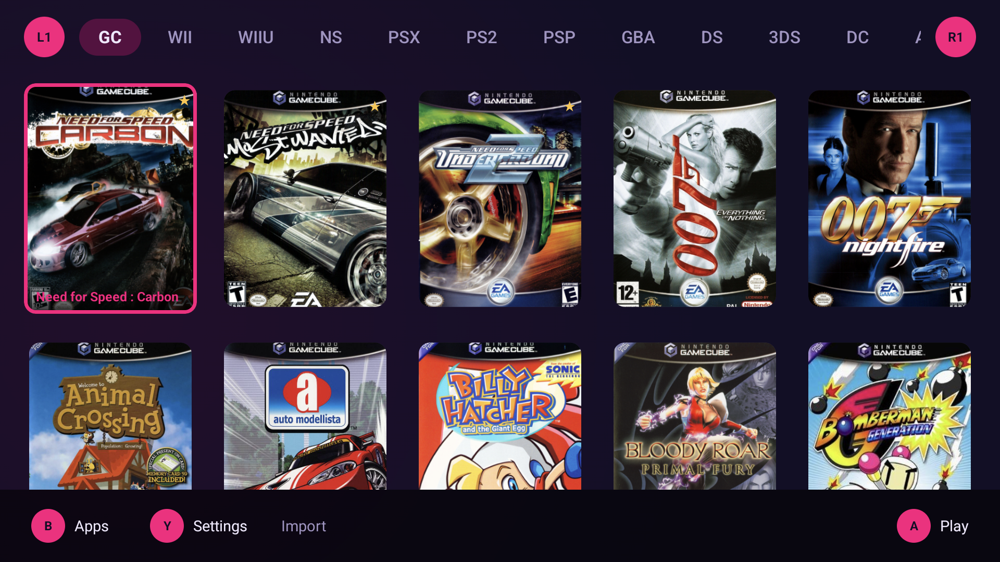
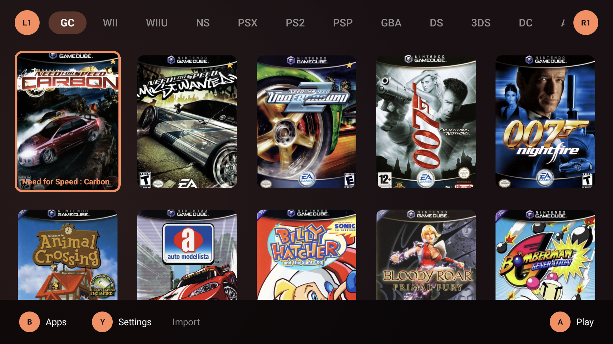

# LH Game Launcher

A console-style game launcher for Android handhelds. Built and tested on the
AYN Odin 2, and usable on any Android 9 or newer device.

LH puts every emulator's launch method in an **editable config file** instead of
a compiled-in list. Adding support for a new emulator is editing a JSON file on
the device, not waiting for a new release.



## Contents

- [Install](#install)
- [Setting up your library](#setting-up-your-library)
- [Colour themes](#colour-themes)
- [Credits and provenance](#credits-and-provenance)
- [Licence](#licence)
- [Where things live](#where-things-live)
- [Building from source](#building-from-source)
- [Status](#status)

## Install

1. Download the latest `LH-<version>.apk` from the
   [Releases](../../releases) page.
2. Open it on the device and allow installation from unknown sources when
   prompted.
3. Optionally set LH as your default launcher (Settings > Apps > Default apps >
   Home app). This is only needed for the app drawer and for launching other
   apps' game shortcuts.

The app icon is a placeholder at the moment.

## Setting up your library

On first run LH asks for one emulator and where its games are, and that is all —
press **Done** at any point and add the rest later. Everything below is in
Settings, opened with **Y** (or by tapping `Y Settings`).

- **Consoles** — one row per system. Open a system to set its ROM folder,
  edit its launch intent, or change its box-art shape.
- **Add a system** — a catalogue of every console from 2000 onward, so a system
  is ready the day an emulator for it appears.
- **Library > Import from Beacon** — brings across an existing Beacon library,
  including artwork. See [docs/BEACON_MIGRATION.md](docs/BEACON_MIGRATION.md).
- **Library > Get missing box art** — fetches covers from libretro's thumbnail
  server. No account or API key needed.

Games spread over several discs are collapsed into one entry that launches the
first disc.

### Controls

| Input | Does |
| --- | --- |
| L1 / R1 | previous / next system |
| D-pad or left stick | move the cursor |
| A | launch the selected game |
| B | app drawer (on the home screen), back (anywhere else) |
| Y | settings |
| Touch | everything above is also tappable, and swiping left/right changes system |

## Colour themes

A theme is a single plain-text file. **The file name is the theme name**, so
`Sunset.theme` appears in the list as "Sunset".



### The short version

Four lines is a complete theme:

```
--main:      #1A1014;
--secondary: #2B1A20;
--accent:    #FF8A5B;
--highlight: #FFD166;
```

Save that as `Sunset.theme`, put it anywhere on the device, then in LH go to
**Settings > Themes > Colours > Add a theme from a file** and pick it.

### What the four colours do

| Role | What it paints | Choose something |
| --- | --- | --- |
| `--main` | the background behind everything | dark — it is most of the screen |
| `--secondary` | cards, panels, settings rows | slightly lighter than `--main` |
| `--accent` | **everything that shows selection**: the ring around the highlighted game, the selected system tab, the L1/R1 chips, the A/B/Y badges | bright, and clearly different from `--main` |
| `--highlight` | secondary emphasis and warnings | a contrasting second colour |

Everything else — body text, dim text, outlines, disabled states — is worked out
from those four. Text colour is chosen from how bright `--main` is, so a light
theme stays readable without you having to think about it.

`--accent` is the one to get right. It is the cursor: if it does not stand out
from `--main`, you will not be able to see what is selected.

### Optional overrides

Add any of these only if you want to override what LH derives:

```
--text:            #F0E9FF;
--text-secondary:  #A99BC4;
--outline:         #3A2E52;
--error:           #FF5C5C;
--surface-variant: #241E3C;
```

If `--text` ends up too close to `--main`, LH says so in
**Settings > Themes > Colours** with the measured contrast ratio, rather than
silently rendering text you cannot read. The bar is the WCAG AA threshold,
4.5:1 for body text.

### Format rules

The format is deliberately forgiving — it is meant to be typed by hand.

- One `role: value;` per line.
- Colours are `#RRGGBB` or `#RRGGBBAA`.
- The `--` prefix is optional: `main: #1A1014;` works.
- The trailing `;` is optional.
- `// line comments` and `/* block comments */` are ignored.
- Blank lines are fine and order does not matter.
- `--background` is accepted as a synonym for `--main`, and `--surface` for
  `--secondary`.

A file missing one of the four required roles is **reported** in Settings, not
silently skipped, so a typo tells you what it is instead of the theme just
never appearing.

### How to write one

**Option A — Notepad (Windows)**

1. Open Notepad and paste in the four lines.
2. File > Save as.
3. Change **Save as type** to **All Files (\*.\*)**. This step matters: left on
   "Text Documents", Notepad quietly saves `Sunset.theme.txt` instead.
4. Name it `Sunset.theme`, leave encoding as UTF-8, and save.

LH tolerates a stray `.txt` on the end and will still name the theme correctly,
but it is cleaner without.

**Option B — VS Code, Notepad++, Sublime Text (any platform)**

Save the file as `Sunset.theme` and you are done; these editors do not add an
extension of their own. Notepad++ and VS Code can both show a swatch next to a
hex colour with a small extension installed, which makes tuning a palette much
easier than guessing.

**Option C — on the handheld itself, no PC**

Install any plain-text editor that lets you choose the file name (Markor and
Acode are both free and work well), write the file into Downloads, and import
it. Useful for tweaking a colour while looking at the result.

**Option D — TextEdit (macOS)**

TextEdit starts in rich-text mode, which will not parse. Choose
**Format > Make Plain Text** first, then save as `Sunset.theme` and untick
"If no extension is provided, use .txt".

### Getting the file onto the device

Anything works — USB cable, Google Drive, email it to yourself, or a USB stick
in the Odin's port. It does not matter where it lands as long as the file picker
can see it; Downloads is the easy choice.

Then: **Settings > Themes > Colours > Add a theme from a file**.

> **Why import instead of copying into the app's folder?** Android 11 and newer
> block file managers and USB access to `Android/data`, so dropping a file
> straight into the themes folder is not possible without adb or root. The
> picker needs no storage permission at all and works everywhere.

### Picking colours

- Any palette site (coolors.co, Adobe Color) gives you `#RRGGBB` to paste in.
- Keep `--main` dark. On the home screen the box art supplies most of the
  colour, and a bright background fights it.
- The bundled themes double as worked examples — `Monolith` is a good starting
  point for something restrained, `Vapor Neon` for something loud.

### Troubleshooting

| What you see | What it means |
| --- | --- |
| The theme is not in the list after importing | It did not parse. The reason is listed in Settings > Themes > Colours. |
| "missing accent" (or another role) | That line is absent, misspelled, or its hex is not 6 or 8 digits after the `#`. |
| Text is hard to read | You set `--text`. Delete that line to go back to the derived colour, which is always legible. |
| The theme is named "Sunset.theme.txt" | Notepad added `.txt` — see Option A above. Rename and import again. |

`Default` is built in, always sits at the top of the list, and cannot be
removed. Selecting it clears the theme setting rather than writing a name.

## Credits and provenance

LH is **inspired by [Beacon Game Launcher](https://play.google.com/store/apps/details?id=com.radikal.gamelauncher)**, which is
the launcher that made an Android handheld feel like a console in the first
place. The debt is real: the shelf layout, the bumper-paged systems, the
two-pane settings and the app drawer on B are all Beacon's shape, and LH is an
attempt at that experience with launch methods that are editable data rather
than a compiled-in list.

Beacon is closed source. **No Beacon code, artwork, fonts or other assets are
used here.** Every line in this repository was written for it — 29 Kotlin
files, and the only third-party dependencies are AndroidX, Jetpack Compose,
kotlinx.serialization and Coil, all under permissive licences.

What LH did take from Beacon is factual rather than creative:

- **Its own package and activity name**, so the launcher can tell you which app
  is currently default.
- **Which scraping services it uses.** Reading the service names told us
  libretro's thumbnail server needs no account; the client that talks to it is
  ours.
- **Your library, with your permission.** The importer reads an export *you*
  produce from your own device. That is your data, not Beacon's.
- **Its layout, as a design reference**, from screenshots of it running.

Interoperability details of this kind — a package name, an intent action, the
name of a public API — are facts about an interface, not authorship. The same
applies to the launch contracts for every emulator LH supports: each was found
by inspecting the app's own manifest and confirmed by launching a real game.

Box art is fetched from libretro at runtime, onto your device, at your request.
LH does not redistribute artwork.

## Licence

**[Apache License 2.0](LICENSE).** Fork it, change it, build on it, ship it —
commercially or not. The one thing asked in return is **credit**:

- Keep the `LICENSE` and `NOTICE` files with any copy you distribute.
- Keep the copyright headers on source files you reuse.
- If you modify a file, say so — a line in the header or your README is enough.
- Don't imply the original author endorses your fork.

That is the whole of it. Apache-2.0 was chosen over MIT because it states the
attribution and change-marking requirements explicitly rather than leaving them
to convention, and because it grants patent rights along with copyright ones,
which matters for anything that might be built on later.

Third-party dependencies (AndroidX, Jetpack Compose, kotlinx.serialization,
Coil) carry their own permissive licences. Box art is fetched from libretro at
runtime, onto your own device — LH does not redistribute artwork.

## Where things live

Everything LH stores is a plain file you can read, edit and back up.

| What | Where |
| --- | --- |
| Launcher settings | `Android/data/org.lighthouse/files/lighthouse.conf` |
| Platform profiles | `Android/data/org.lighthouse/files/platforms/*.json` |
| Colour themes | `Android/data/org.lighthouse/files/themes/colors/*.theme` |
| Library and artwork | `Android/data/org.lighthouse/files/library.json` and `media/` |

The debug build uses `org.lighthouse.debug` instead. Remember that Android 11+
blocks access to these paths from a file manager — use the in-app importers, or
adb if you are comfortable with it.

## Building from source

```
git clone <this repo>
cd LightHouse
echo "sdk.dir=/path/to/Android/Sdk" > local.properties
./gradlew :app:assembleDebug
```

The APK lands in `app/build/outputs/apk/debug/`. Requires JDK 17 and the
Android SDK with API 35.

## Status

Working: library import, folder scanning, multi-disc grouping, box-art
scraping, the launch-intent editor, colour themes, pad and touch navigation
throughout.

Known gaps:

- No app icon yet.
- Themes cannot be deleted from the UI, only added.
- Search and the per-game detail view are placeholders.
- Most launch contracts are marked `untested` until you test them; GameCube,
  Xbox and Xbox 360 are confirmed working.

More detail lives in [docs/](docs/): [ARCHITECTURE.md](docs/ARCHITECTURE.md),
[LAUNCH_CONTRACTS.md](docs/LAUNCH_CONTRACTS.md),
[CUSTOM_PLATFORM.md](docs/CUSTOM_PLATFORM.md),
[THEMING.md](docs/THEMING.md),
[BEACON_MIGRATION.md](docs/BEACON_MIGRATION.md).
